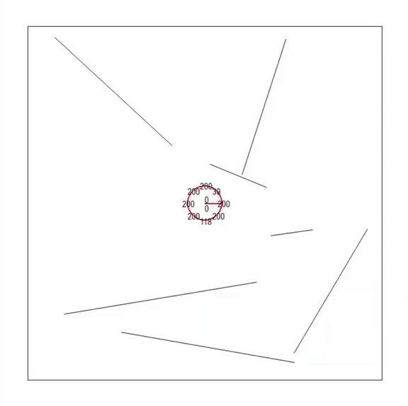

# [Autonomous Robotic Systems](https://github.com/AlexandraDI/Autonomous_Robotic_Systems)

Implementation of 5 Assignments for the course Autonomous Robotic Systems.
Contributors: Gianluca Vico.

* [Task 1](https://github.com/AlexandraDI/Autonomous_Robotic_Systems/tree/main/Assignment1): Test a Swarm Intelligence algorithm on Benchmark Functions.
Description of the task [here.](https://github.com/AlexandraDI/Autonomous_Robotic_Systems/blob/main/Assignment1/02d%20ARS%20-%20Assignment%20Swarm%20Intelligence.pdf)

* [Task 2](https://github.com/AlexandraDI/Autonomous_Robotic_Systems/tree/main/Assignment2): Implementation of a Robot Simulator.
Description of the task [here.](https://github.com/AlexandraDI/Autonomous_Robotic_Systems/blob/main/Assignment2/07%20ARS%20-%20Assignment%20Mobile%20Robot%20Simulator.pdf)

<!-- 
 -->

  

 
 * [Task 3](https://github.com/AlexandraDI/Autonomous_Robotic_Systems/tree/main/Assignment3): Apply Evolutionary Algorithms on Benchmark Functions.
Description of the task [here.](https://github.com/AlexandraDI/Autonomous_Robotic_Systems/blob/main/Assignment3/12%20ARS%20-%20Assignment%20Evolutionary%20Robotics.pdf)
 
 
  
  

* [Task 4](https://github.com/AlexandraDI/Autonomous_Robotic_Systems/tree/main/Assignment4): Apply Evolutionary Algorithm to make the Robot collect as much dust as possible in different Environments.
Description of the task [here.](https://github.com/AlexandraDI/Autonomous_Robotic_Systems/blob/main/Assignment3/12%20ARS%20-%20Assignment%20Evolutionary%20Robotics.pdf)

  

* [Task 5](https://github.com/AlexandraDI/Autonomous_Robotic_Systems/tree/main/Assignment5): Mobile Robot Localization with Kalman Filters.
Description of the task [here.](https://github.com/AlexandraDI/Autonomous_Robotic_Systems/blob/main/Assignment5/20%20ARS%20-%20Assignment%20Localization.pdf)

  

